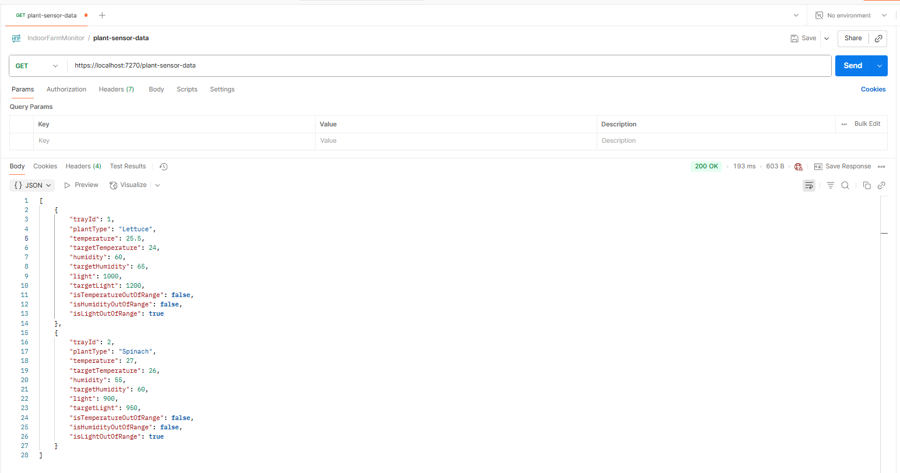

# 🌱 **Indoor Farm Monitoring System**

## 🎯 **Objective**
A modern ASP.NET Core 8 Web API project that integrates with two external APIs — **Sensor Data API** and **Plant Configuration API** — to collect, merge, and compare plant sensor readings with configured target metrics. The processed data is then persisted and exposed via a HTTP endpoint.

---
## 🚀 **Features**
- Integrates with:
  - Sensor Readings API
  - Plant Configurations API
- Merges the data using `tray_id`
- Flags each reading with:
  - `IsTemperatureOutOfRange`
  - `IsHumidityOutOfRange`
  - `IsLightOutOfRange`
- Supports multiple storage backends:
  - PostgreSQL (via Entity Framework Core)
  - JSON file (`plant_data.json`)
  - In-memory list
- Exposes endpoint: `GET /plant-sensor-data`
- Includes:
  - Swagger (OpenAPI)
  - Dependency Injection
  - Logging
  - Basic error handling
  - Unit tests

---
## 💻 **How to Run Locally**
### Prerequisites
- [.NET 8 SDK](https://dotnet.microsoft.com/download/dotnet/8.0)
- [PostgreSQL](https://www.postgresql.org/)
- [Postman](https://www.postman.com/) or `curl` for testing APIs (optional)

---
### Step 1: Clone the Repository
```bash
git clone https://github.com/zplim9338/IndoorFarmMonitor.git
cd IndoorFarmMonitor
```

### Step 2: Create Database Schema and Table Structure
SQL scripts are located in the `IndoorFarmMonitor/Database` folder:
```
IndoorFarmMonitor/Database
├── Database
├── Table
```
Run the SQL scripts to create the necessary schema and tables in PostgreSQL instance.

### Step 3: Configure Database Connection String 
Set the database connection string via environment variables
```powershell
[Environment]::SetEnvironmentVariable("ConnectionStrings__IndoorFarmDb", "Host=localhost;Database=db_indoor_farm;Username=yourusername;Password=yourpassword", "user")
```

Alternatively, `appsettings.Development.json` can be used for local development:
```json
{
  "ConnectionStrings": {
    "IndoorFarmDb": "Host=localhost;Database=db_indoor_farm;Username=yourusername;Password=yourpassword"
  }
}
```

### Step 4: Configure Storage Type
To configure the storage type, modify the `appsettings.json` file.

There are three available storage options: "PostgreSql", "JsonFile", or "InMemory".
```json
{
  "Storage": {
    "Type": "PostgreSql" // "PostgreSql" or "JsonFile" or "InMemory"
  },
}
```

### Step 5: Run the API
Open `IndoorFarmMonitor.sln` in Visual Studio:
1. Select `IndoorFarmMonitor` as the startup project.
2. Press **F5** or click **Start Debugging**.

The API will launch with the Swagger UI.

---
## 🔐 **Environment Variable**
The application uses environment variables for sensitive configuration, particularly the PostgreSQL connection string.
| Variable Name                     | Description                            | Example Value                                                                        |
| --------------------------------- | -------------------------------------- | ------------------------------------------------------------------------------------ |
| `ConnectionStrings__IndoorFarmDb` | Database connection string for EF Core | `Host=localhost;Database=db_indoor_farm;Username=yourusername;Password=yourpassword` |

### Windows PowerShell
```powershell
[Environment]::SetEnvironmentVariable("ConnectionStrings__IndoorFarmDb", "Host=localhost;Database=db_indoor_farm;Username=yourusername;Password=yourpassword", "user")
```

---
## 📬 **Sample API Calls**
### CURL
```Bash
curl https://localhost:7270/plant-sensor-data
```

### Postman
- Method: GET  
- URL: `https://localhost:7270/plant-sensor-data`



---
## 🔄 **Switch between PostgreSQL, JSON, or in-memory**
Storage type can be switched by updating the `Storage:Type` value in `appsettings.json`:
| Type        | Description                                 |
|-------------|---------------------------------------------|
| PostgreSql  | Persists merged data to PostgreSQL          |
| JsonFile    | Saves merged data to `plant_data.json`      |
| InMemory    | Keeps data in a runtime memory list         |

---
## 📏 **Threshold Options**
- Thresholds define the acceptable deviation for sensor values. If the difference exceeds the threshold, the corresponding `IsXOutOfRange` flag is set to `true`.

---
## 📝 **Logging**
- Logging is handled by **Serilog** and writes to daily rolling log files in the `Logs/` directory. By default, only `warnings` and above are logged.

---
## ❌ **Error Handling**
- Failed API fetch
- Timeout
- Empty or malformed data

---
## 🧪 **Unit Testing**
NUnit testing has been implemented in this project. Tests can be executed using the built-in test runner in Visual Studio (**Test > Run All Tests**) or via the command line:
```bash
dotnet test
```